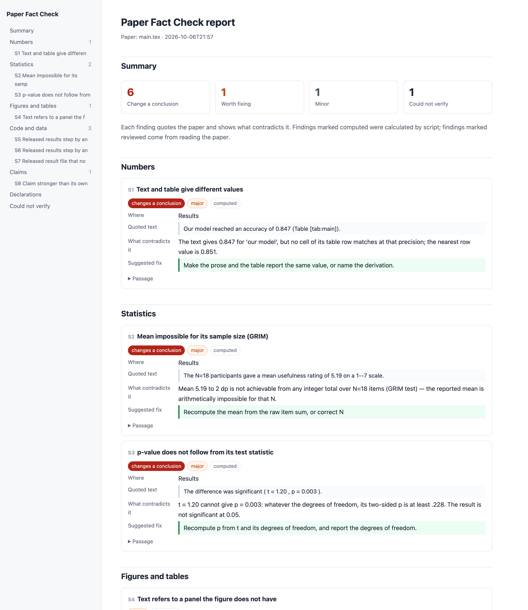

# Paper Fact Check

**Fact-check your paper against its own evidence before reviewers do.**

[English](README.md) · [简体中文](README.zh-CN.md)

  

Paper Fact Check reads a manuscript, and its code and data if you have them, and reports every place where the paper disagrees with itself: numbers that differ between abstract and table, p-values that do not follow from their statistics, references that do not exist, conclusions stronger than the results. Each finding quotes the paper, shows the arithmetic, and gives a sentence you can paste in.

It works on any field and any language the paper is written in, from a PDF, Word file, or LaTeX/Overleaf project.

---

## A real example

A 2026 arXiv paper (ICRA 2026), version 1, Figure 2 caption:

> "achieving 41.4% bandwidth reduction (800 vs 2800 bits)"

```
[major · changes the conclusion]  Relative change does not match its own numbers
Where     Abstract; Section I; Figure 2 caption; Sections VI and VII
Evidence  800 vs 2800 bits per episode (Figure 2 caption; Table I)
Check     1 − 800 / 2800 = 71.4%, not 41.4%
Fix       "achieving 71.4% bandwidth reduction (800 vs 2800 bits)"
```

The authors corrected every occurrence to 71.4% in version 2. Paper Fact Check flags version 1 and reports nothing on version 2.

---

## Quick start

**In your coding agent (Claude Code, Codex, Cursor, OpenCode, Gemini CLI and 80+ others)**

```bash
npx skills add Biajin-PKU/paperfactcheck
```

then, in the agent:

```
/paperfactcheck paper.pdf
/paperfactcheck overleaf-project.zip --code ./repo
```

| Where you work | How to install |
|---|---|
| Claude Code plugin | `/plugin marketplace add Biajin-PKU/paperfactcheck`, then `/plugin install paperfactcheck@paperfactcheck` |
| OpenClaw, Hermes and other ClawHub clients | `clawhub install paperfactcheck` |
| Claude.ai | Download `paperfactcheck-skill.zip` from Releases, upload under *Settings → Skills* |
| Clone and run | `git clone https://github.com/Biajin-PKU/paperfactcheck && python3 paperfactcheck/skills/paperfactcheck/run.py paper.pdf` (no dependencies) |
| Command line | `uvx --from git+https://github.com/Biajin-PKU/paperfactcheck paperfactcheck paper.pdf` |
| Claude Desktop, Cursor, any MCP client | `paperfactcheck mcp` ([config](docs/mcp.md)) |
| GitHub / Overleaf git sync | [GitHub Action](docs/action.md): checks the paper on every push |
| ChatGPT, Kimi, Doubao, any chat | Paste [`prompt.md`](prompt.md) ([中文](prompt.zh-CN.md)), attach the PDF. No install; arithmetic is done by the model, so expect fewer findings |

---

## What it checks

**Numbers**
- The same quantity given different values in abstract, text, tables, and captions
- "Improved by X%" against the two numbers it compares
- Percentages against their counts; parts that do not add up to the total

**Statistics**
- p-values recomputed from t, F, χ², r, z and degrees of freedom, including where the conclusion flips
- Confidence intervals that contradict their p-value; estimates outside their own interval
- Effect sizes recomputed from reported statistics
- Means and standard deviations that integer data cannot produce (GRIM, GRIMMER)
- "Better" or "significant" next to an interval that includes no effect
- Results more regular than measurement allows

**References**
- Whether each reference exists, with correct authors, year, venue, and DOI
- Retracted papers and expressions of concern
- Whether the cited paper says what the sentence attributes to it
- Citations missing from the list, and list entries never cited

**Figures and tables**
- Panels referred to but not present; tables and figures never referred to
- Captions that describe something the figure does not show

**Code and data** (when provided)
- Runs the released code and compares its output with the paper's numbers
- Code that computes something other than what Methods describe
- Train/test leakage and evaluations that can only agree
- Result files that no test reads

**Reporting standards**
- Detects the study type and checks the matching guideline: CONSORT, STROBE, PRISMA, ARRIVE, STARD, TRIPOD+AI, COREQ
- Ethics approval, consent, conflicts of interest, funding, data and code availability, trial registration
- Sample size justification, randomisation, blinding

**Claims**
- Causal wording on observational data; hedged findings written as certain
- An abstract that claims more than the results show
- Planned work reported as achieved; selectively reported subgroups or thresholds

**Traces of AI writing**
- Leftover assistant text, placeholders, and `[citation needed]`
- Tortured phrases: fixed terms broken by synonym substitution
- One concept under several names; abbreviations used before they are defined

---

## What you get

A single HTML report that opens in any browser, plus Markdown and JSON.

- **Summary**: how many findings change a conclusion, how many are worth fixing, what could not be checked
- **Every finding**: the quoted passage and where it is, the conflicting evidence, the calculation, a replacement sentence, and its severity
- **Could not verify**: what was not checked and why (no code supplied, a reference lookup failed), so nothing is silently skipped
- The report is written in the language you ask in



Sample reports: [English](examples/demo/report/report.md) · [Chinese, with the review pass](examples/demo-zh/report/report.md). The HTML versions are beside them.

---

## Why you can trust a finding

- **Computed, not guessed.** Anything arithmetic can settle is calculated by a script, so those findings are the same on every run and with every model.
- **Quoted, not paraphrased.** A finding exists only if it can point to the passage and the evidence that contradicts it.
- **Inconsistency, not accusation.** It reports what the paper says and what disagrees with it. It never infers intent.
- **Every candidate is confirmed.** The reviewing model opens each script finding in the paper and dismisses misreadings before the report is written.

## Benchmarks

Built from public arXiv sources and reproducible; details in [`benchmark/`](benchmark/README.md). These measure the script layer alone, before the model review.

| Test | Result |
|---|---|
| 14 papers whose authors later corrected numbers | Flagged on the uncorrected version: 1 (the 41.4% case above). Most corrections change text and table together, so the uncorrected version does not contradict itself |
| 182 recent papers never used in development (3 sets, different fields) | 25 major findings, each checked by hand: 5 real (citation keys with no bibliography entry, figure panels the caption does not describe), the rest false alarms. Each set's false-alarm patterns were fixed before the next set; the last set of 50 papers raised 1, a false alarm |

So a script finding is a candidate, and the confirmation step above is part of the tool, which is why it runs as a skill.

---

## What it does not do

- Plagiarism or AI-text percentage scores. Use the platform your institution specifies.
- Image manipulation forensics.
- Judge novelty or importance.
- Decide whether misconduct happened.

## Privacy

The manuscript stays on your machine and with the model you already use. Reference checks send only the reference metadata to Crossref, OpenAlex, arXiv, and PubMed; turn them off with `--offline`.

## FAQ

**How is this different from asking ChatGPT to review my paper?**
A chat model reads and gives an opinion, and gives a different one each time. Paper Fact Check recomputes the paper's numbers, looks every reference up, and only reports what it can quote.

**Will it flag things that are fine?**
Sometimes, for example a number that differs because it comes from another condition. Every finding shows its evidence, so it takes seconds to dismiss.

**Which fields does it work for?**
Any field that reports numbers, statistics, or references. Reporting-standard checks cover clinical, biomedical, social science, and machine learning study types.

**What file types?**
PDF, Word (.docx), LaTeX folders or zip (including Overleaf exports), Markdown. Code and data folders are optional.

## License

MIT
