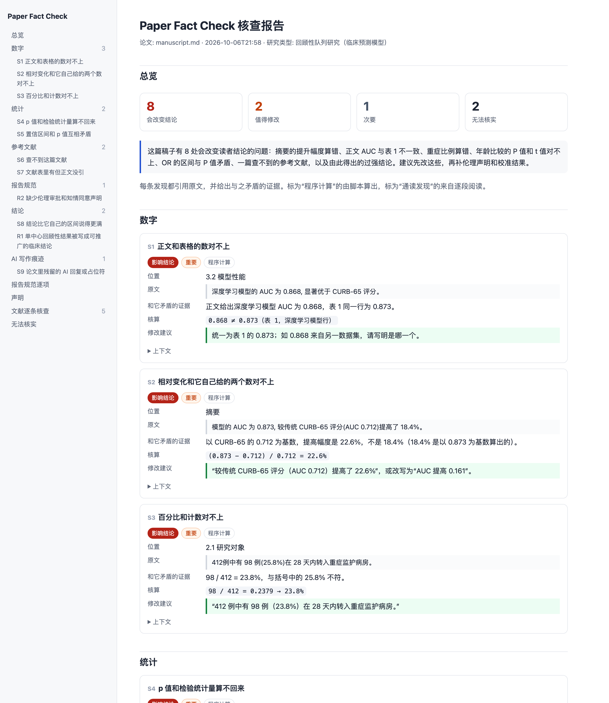

# Paper Fact Check

[](https://github.com/Biajin-PKU/paper-fact-check/actions/workflows/ci.yml)
[](https://github.com/Biajin-PKU/paper-fact-check/releases)
[](pyproject.toml)
[](LICENSE)

**[检查项](docs/checks.md)** | **[基准测试](benchmark/README.md)** | **[MCP](docs/mcp.md)** | **[GitHub Action](docs/action.md)** | **[English](README.md)**

论文事实核查工具。它按论文自己给出的数重算统计量、百分比和变化幅度，核对正文与表格，逐条查询参考文献。每条发现都引用原文、给出算式和修改建议。

它可以作为 skill 在 Claude Code、Codex、Cursor 等编程智能体里运行，由模型逐条复核发现，并通读算术判断不了的部分；也可以单独在命令行运行。

```console
$ paper-fact-check manuscript.md
manuscript.md
  S1  major    * 正文和表格的数对不上        3.2 模型性能
        The text gives 0.868 for '深度学习模型', but no cell of its table row matches at that precision; the
        nearest row value is 0.873.
  S2  major    * 相对变化和它自己给的两个数对不上  摘要
        The sentence gives a 18.4% change of 0.873 over 0.712, but relative to 0.712 those numbers give
        22.6%.
  S3  major    * 百分比和计数对不上         2.1 研究对象
        98 of 412 is 23.8%, not 25.8%.
  …

9 findings: 7 change a conclusion (*), 1 worth fixing, 1 minor.
References: 5 looked up (1 not found, 4 verified).
Report: report/report.html
```

- 41 项计算和联网核查，覆盖数字、统计、参考文献、图表、公开的代码和数据，清单见 [docs/checks.md](docs/checks.md)
- 参考文献逐条查询 Crossref、OpenAlex、arXiv 和 doi.org：是否存在、DOI 是否对应、是否撤稿
- 模型复核结论表述、报告规范（CONSORT、STROBE、PRISMA、ARRIVE、STARD、TRIPOD+AI、COREQ）和各类声明
- 支持 PDF、Word、LaTeX 文件夹和 Overleaf 压缩包、Markdown；中英文论文
- 输出 HTML、Markdown、JSON 三种报告
- 只依赖 Python 3.9 标准库；稿件不会上传到任何地方

<p align="center"></p>

完整示例：[原稿](examples/demo-zh/manuscript.md) · [报告](examples/demo-zh/report/report.md)（HTML 版在同一目录）

## 安装

作为 skill，用于 Claude Code、Codex、Cursor、OpenCode、Gemini CLI 等[智能体](https://github.com/vercel-labs/skills)：

```console
$ npx skills add Biajin-PKU/paper-fact-check
```

作为 Claude Code 插件：

```console
/plugin marketplace add Biajin-PKU/paper-fact-check
/plugin install paper-fact-check@paper-fact-check
```

从 [ClawHub](https://clawhub.ai) 安装（OpenClaw、Hermes）：

```console
$ clawhub install paper-fact-check
```

作为命令行工具：

```console
$ uvx --from git+https://github.com/Biajin-PKU/paper-fact-check paper-fact-check paper.pdf
```

或者不安装，直接运行：

```console
$ git clone https://github.com/Biajin-PKU/paper-fact-check
$ python3 paper-fact-check/skills/paper-fact-check/run.py paper.pdf
```

在 Claude 网页版中，从[最新发布页](https://github.com/Biajin-PKU/paper-fact-check/releases/latest)下载 `paper-fact-check-skill.zip`，在设置中作为自定义 skill 上传。在其他对话助手（ChatGPT、Kimi、豆包等）中，粘贴 [`prompt.zh-CN.md`](prompt.zh-CN.md) 并上传论文即可；没有脚本时，算术由模型自己完成。

读取 PDF 需要 `pdftotext`（poppler）或 `pypdf`；两者都没有时，由智能体直接读 PDF。

## 使用

在智能体中：

```console
/paper-fact-check 论文.pdf
/paper-fact-check overleaf项目.zip --code ./代码目录
```

智能体会先运行检查，再回到原文逐条确认、剔除误读，然后对照[通读清单](skills/paper-fact-check/references/checklist.md)和相应的报告规范通读全文，最后生成报告。

命令行：

```console
$ paper-fact-check [check] 论文 [--code 目录] [--out 目录] [--offline] [--lang auto|en|zh] [--json]
$ paper-fact-check render 目录
$ paper-fact-check mcp
```

| 参数 | |
|---|---|
| `论文` | `.pdf`、`.docx`、`.tex`、LaTeX 文件夹、`.zip`、`.md` 或 `.txt` |
| `--code 目录` | 公开的代码或数据；提供后才运行代码和数据相关的检查 |
| `--out 目录` | 报告目录，默认 `paper-fact-check-<文件名>` |
| `--offline` | 不联网查询参考文献 |
| `--lang` | 报告语言；`auto` 跟随论文语言 |
| `--json` | 以 JSON 输出发现 |

在报告目录中加入 `review.json` 后，用 `render` 重新生成报告（[格式说明](skills/paper-fact-check/references/review-format.md)）。`mcp` 以 Model Context Protocol 提供检查（[配置](docs/mcp.md)）。[GitHub Action](docs/action.md) 可在每次推送时检查论文。

退出码：没有影响结论的发现时为 0，有则为 1，文件无法读取时为 3。

## 工作原理

1. **读取。** 各种格式统一转成文本；Word 和 Markdown 里的表格重建为表格，以便与正文比对。
2. **计算。** 提取论文报告的统计量、百分比、变化幅度、均值和表格数值，按论文自己的数重算，并考虑印刷时的四舍五入。
3. **查询。** 按 DOI、编号或引用文本在 Crossref、OpenAlex、arXiv 中匹配每条参考文献；撤稿信息来自 Crossref。
4. **复核。** 作为 skill 运行时，模型回到原文逐条确认脚本的发现、剔除误读，再通读结论、报告规范条目和声明。
5. **报告。** 按类别分组，每条给出原文、证据、算式和修改建议。

## 误报

脚本的发现是候选。误报多数来自三种情况：把数字对应到了错误的表格行或实验条件、把参数设置当成结果、句子没写明的单侧检验。复核这一步就是为了剔除这些误报；被剔除的发现仍保留在报告中，并写明理由。

在开发中从未用过的 182 篇近期 arXiv 论文上，脚本报出 25 条严重级发现，人工逐条核对后 5 条属实（引用键在文献库中不存在、正文引用的子图图注中没有），其余为误报。每批暴露的误报类型都在下一批之前修复，最后一批 50 篇只报出 1 条。细节和数据见 [benchmark/](benchmark/README.md)。

## 范围

Paper Fact Check 报告论文与自身、与引用来源不一致的地方。它不做查重和 AI 生成率评分，不鉴定图片篡改，不评价创新性，也不判定是否存在学术不端。

联网查询时只把参考文献条目发送给 Crossref、OpenAlex、arXiv 和 doi.org，不发送稿件。其余步骤都在本地和你正在使用的模型中完成。

## 参与开发

见 [CONTRIBUTING.md](CONTRIBUTING.md)。新增检查需要自带测试，并在未见过的论文上人工核对一轮。

## 许可证

MIT
